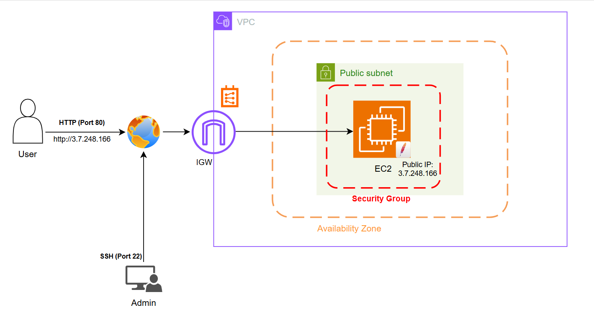
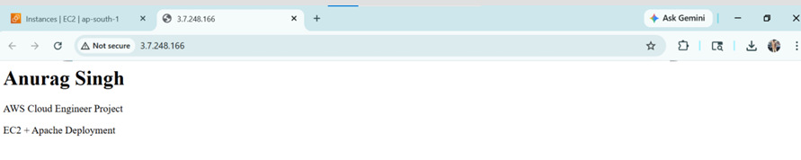

# EC2 Apache Web Server Deployment (AWS)

## Project Overview
This project demonstrates how to deploy a simple static website on an AWS EC2 instance using the Apache Web Server. 
The goal was to understand how cloud virtual machines host web applications and how users access them through the internet.

## Architecture

User → Internet → Internet Gateway → Public Subnet → EC2 → Apache Web Server

Admin Access:
Admin → Internet → Internet Gateway → EC2 (SSH)

## AWS Services Used
- Amazon EC2
- Amazon VPC
- Internet Gateway
- Security Groups

## Webpage Output
Access the deployed webpage using the EC2 Public IP:
http://3.7.248.166

## Key Learning
- Deploying a web server on EC2
- Configuring security groups for HTTP and SSH
- Understanding VPC networking and Internet Gateway
- Hosting a static webpage on a cloud server

## Detailed Documentation
A detailed step-by-step explanation of this project is available in the repository document:

`EC2_Apache_Web_Server_Project_Documentation.docx`
